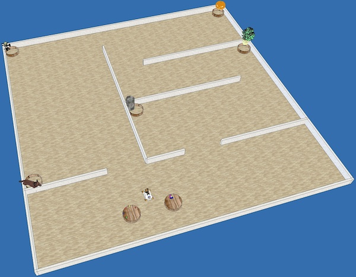
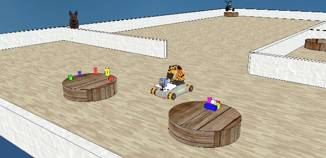

# Project (before 2019-2020)

The goal of the project is to program a youBot to put away groceries. You have control of one youBot that can move around a virtual house. Groceries are waiting in the hall. You need to provide the youBot with a program that allows it to move the groceries to their appropriate storing locations.

Object are either cylindrical or box-shaped. The bases of boxes and cylinders are fixed, only their height varies. The base of box-like objects is 50 mm by 50 mm. The diameter of the base of cylinders is 50 mm. The color of objects varies. Objects are initially placed on two tables facing the youBot's starting position. (The two tables are visible with the Hokuyo sensor from the youBot's starting position. No other cylindrical objects are within sight of the Hokuyo from the youBot's starting position.) On one table, objects are placed upright. On the other table, objects are not necessarily placed upright – they may be laid down or tilted.

The size of the house is fixed (see `house.ttt`). However, the youBot does not know the layout of the house a priori. All obstacles are high enough to be detectable with the Hokuyo sensor. There are no holes or open doors leading outside the house. There are five baskets around the house, whose location is not fixed, although they are always close to room/hallway corners. Baskets and tables are cylinders, 800 mm in diameter, and 185 mm in height. The tables and baskets are the only cylindrical objects resting on the floor. Next to each basket is a landmark object (of approximately the same size as the youBot), that allows the youBot to identify the room in which it is located. For instance, one basket could be placed next to a bike (garage), or next to a computer (office). The youBot has access to a list of instructions consisting of pairs of object descriptors (green box, blue cylinder...) and images. Instructions are accessed via `load instructions.mat inst`. This structure follows the following schema:

*   `inst(1).shape`: shape of the first object (either `box` or `cylinder`).
*   `inst(1).color`: color of the first object (R, G, B values).
*   `inst(1).picture`: path to an image of the landmark next to which is located the basket in which object 1 must go.
*   `inst(2).shape`: shape of the second object (either `box` or `cylinder`).
*   `inst(2).color`: color of the second object (R, G, B values).
*   `inst(2).picture`: path to an image of the landmark next to which is located the basket in which object 2 must go.
*   ...

The goal of the project is to move each object to the appropriate basket. At most one object can be stored on the platform of the youBot. The image below illustrates the layout explained above. A CoppeliaSim file similar to the one on which projects will be tested is available in the Git repository (see directory `youbot`).

## Milestones

1.  **Navigation**  
    Building a map of the house (a map of the walls and other obstacles).

    1.  Using accurate localization (via [`simxGetObjectPosition`](https://www.coppeliarobotics.com/helpFiles/en/remoteApiFunctionsPython.htm#simxGetObjectPosition) on `youBot_ref` or `youBot_center`)

    2.  Without using [`simxGetObjectPosition`](https://www.coppeliarobotics.com/helpFiles/en/remoteApiFunctionsPython.htm#simxGetObjectPosition) on `youBot_ref` or `youBot_center`.

2.  **Manipulation**  
    Picking up objects and moving them to any room of the house (except the room where the objects start in), not necessarily in a basket.

    1.  Moving only the objects from the first table (where objects stand upright), using V-REP IK. Objects can fall on the floor.

    2.  Moving all the objects (both tables), using V-REP IK. Objects can fall on the floor.

    3.  Moving all the objects (both tables), using V-REP IK. Objects _cannot_ fall on the floor.

    4.  Moving all the objects (both tables), _without_ using V-REP IK. Objects _cannot_ fall on the floor.

3.  **Vision**  
    Finding and identifying the baskets.

    1.  Finding the baskets and the tables.

    2.  Recognizing the landmark objects accompanying the baskets, based on the data from `instructions.mat`.

4.  **Manipulation and Vision**

    1.  Placing the objects into arbitrary baskets (as long as there is the same number of objects in each basket). (Requires at least 2.i and 3.i.)

    2.  Placing the objects into the appropriate basket, as indicated by `instructions.mat`. (Requires at least 2.i and 3.ii.)

5.  **Calibration**  
    Computing the transformation between the frame of the vision sensor, and the frame of the robot. (Without `simxGetObjectOrientation` on `rgbdSensor`.)

6.  **Bonus Milestone: create a video of your work!**  
    Ideally including a view from the simulator, and of the robot process (for instance, the map being constructed). In V-REP, the menu _Tools_ has a _Video Recorder_ option that allows you to save the simulator's image stream to disk.

For you to claim a milestone, your robot must be able to perform the corresponding task _without_ prior knowledge of the room in which it is placed (except for the hypotheses mentioned on this page).
