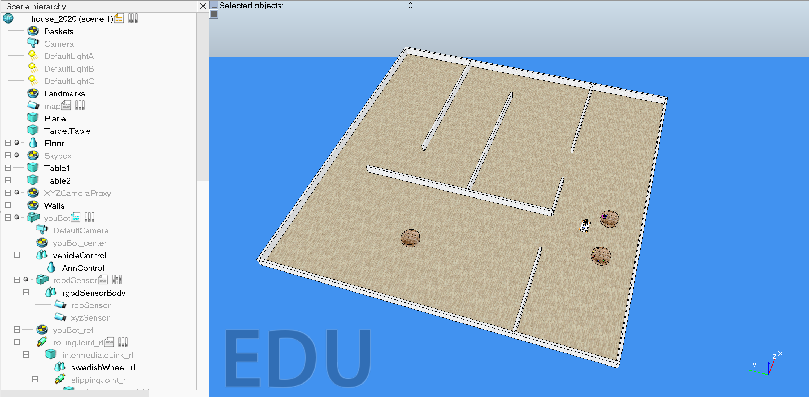

# 2019-2020 Project

## Context

In this project, you will program a robotic agent that (i) gathers information about its environment using the sensors, (ii) plans a set of actions to respond appropriately to sensed data based on a pre-existing strategy, and (iii) executes a set of motor commands to carry out the actions that the plan calls for. The robot will be simulated in the robot simulator [CoppeliaSim](https://www.coppeliarobotics.com/).

The general framework for the project relies on [TRS](http://ulgrobotics.github.io/trs/), an open-source project developed by [Renaud Detry](http://renaud-detry.net/). TRS's [website](http://ulgrobotics.github.io/trs/) and [GitHub repository](https://github.com/ULgRobotics/trs) are full of useful information:

*   [detailed installation instructions](http://ulgrobotics.github.io/trs/setup.html),
*   [complete demo of the youBot (Matlab)](https://github.com/ULgRobotics/trs/blob/master/youBot/),
*   [more focused demos of the youBot (Matlab)](https://github.com/ULgRobotics/trs/tree/master/youBot/focused),
*   [list of forbidden functions](http://ulgrobotics.github.io/trs/project.html#api).

The [help](https://www.coppeliarobotics.com/helpFiles/) of the robot simulator CoppeliaSim is also a good source of information.

## Specific milestones

1. **Navigation**  
    For this milestone, you should build a custom controller for the youBot, which should use its holonomic properties. In particular, _we do not allow the use of pure pursuit controller controllerPurePursuit from Matlab's Robotics System Toolbox._

    1. (compulsory): Explore the whole map (and build an appropriate representation), by accessing the GPS coordinates (i.e. `simxGetObjectPosition` can be used on the youBot). For this milestone you can call `simxGetObjectOrientation` on the youBot whenever needed.

    2. (compulsory): Same as (1.i), but `simxGetObjectPosition` can only be called once per minute (note that the exploration should remain fluid). For this milestone you can call `simxGetObjectOrientation` on the youBot whenever needed, there is no restriction.

    3. (optional): Same as (1.i) but without calling `simxGetObjectPosition` at all, furthermore, for this milestone you can not call `simxGetObjectOrientation` on the youBot at all.

2. **Manipulation**  
    For this Milestone, the youBot will need to access a “TargetTable” object, which position you will have to find thanks to the youBot's sensors. Note that this table is the same as the ones on which objects are initially lying. _To distinguish them, you can make the assumption that the "TargetTable" will always start empty (no objects initially lying on it)._

    1. (compulsory): The youBot should grab all the object on table 1, without any falling on the ground and put them on the target table.

    2. (optional): The youBot should grab all the object on both tables, without any falling on the ground and put them on the target table.

## Instructions

* You can work in teams of up to two people.

* Your deliverables must be submitted as a _zip_ archive on the [Montefiore submission platform](https://submit.montefiore.ulg.ac.be/).

* Important dates (unless otherwise noted, all project items are due by 11:59 pm):

    *  01/04/2020: midterm code and report,
    *  29/05/2020 ~~(15/05/2020)~~: final code and report,
    *  02-03/06/2020: final presentation.

## Midterm report

For the midterm report, we expect you to complete the **Navigation (1.i)**.

Each team must submit a _zip_ archive containing:

*   The source code of the youBot.

*   A short commented video or a link to the video (max. 5 minutes).

    In the video, the youBot should explore and eventually map its entire environment. The video should show the youtBot in action but should also emphasize how the youBot plans its actions. For example, showing the evolution of the map as the youBot builds it, showing potential new targets to explore and how the youBot chooses one, showing the planned trajectory to the chosen target, etc.

    The video should last (at most) 5 minutes.

*   A short written report named `midterm-report.pdf` (max. 1 page).

    In the report, you should summarize the main points of your implementation. The report should _not_ consist of a list of functions that you used in your project. We are more interested in the _why_ than the _what_. For example, if you chose a specific pathfinding algorithm, explain why this one and not another. In addition, the report should contain a diagram of the finite state machine controlling your youBot.

    The report should be (at most) one page long using the provided LaTeX template ([ieeeconf.zip](docs/ieeeconf.zip)).

The midterm report is due on the [Montefiore submission platform](https://submit.montefiore.ulg.ac.be/) on April 1, 2020, at 11:59 pm. This is a hard deadline.

## Midterm feedback

Here is the [midterm feedback](docs/midterm-feedback.pdf).

## Final report

For the final report, we expect you to complete all compulsory milestones (and some of the optional milestones if you want to).

Each team must submit a _zip_ archive containing:

*   The source code of the youBot.

*   A video (or a link to the video in the report).

    In the video, the youBot should solve the milestones on the provided map. The video should show the youtBot in action but should also emphasize how the youBot plans its actions.

*   A short written report named `final-report.pdf` (between five and ten pages).

    In the report, you should summarize the main points of your implementation. The report should _not_ consist of a list of functions that you used in your project. We are more interested in the _why_ than the _what_. For example, if you chose a specific pathfinding algorithm, explain why this one and not another.

    In addition, the report should contain a diagram of the finite state machine controlling your youBot.

    The report should be between five and ten pages long using the provided LaTeX template ([ieeeconf.zip](docs/ieeeconf.zip)).

The final report is due on the [Montefiore submission platform](https://submit.montefiore.ulg.ac.be/) on May 15, 2020, at 11:59 pm. This is a hard deadline.

## Final presentation

The final presentation consists of:

*   a live demonstration of your solutions on a new map with a live comment from your team. The video will be used as a back-up solution in case your code doesn't run as expected on the new map.

*   (if needed) a short slide presentation to further explain some of your ideas.

*   a discussion with the teaching team to place your work in the context of the course.

We will provide a new map 15 minutes before your presentation. So be ready to run your code on _your_ laptop (we highly recommend using one of the laptops that you used to develop your project).

## Useful links

*   [Robotics System Toolbox](https://www.mathworks.com/products/robotics.html), by MathWorks
*   [Robotics Toolbox for MATLAB](https://petercorke.com/toolboxes/robotics-toolbox/), by Peter Corke
*   [OBS Studio](https://obsproject.com/), a free and open-source software suite for recording

## Montefiore server access via ssh

[Document borrowed from INFO2009.](docs/devoirs-ssh.pdf)
