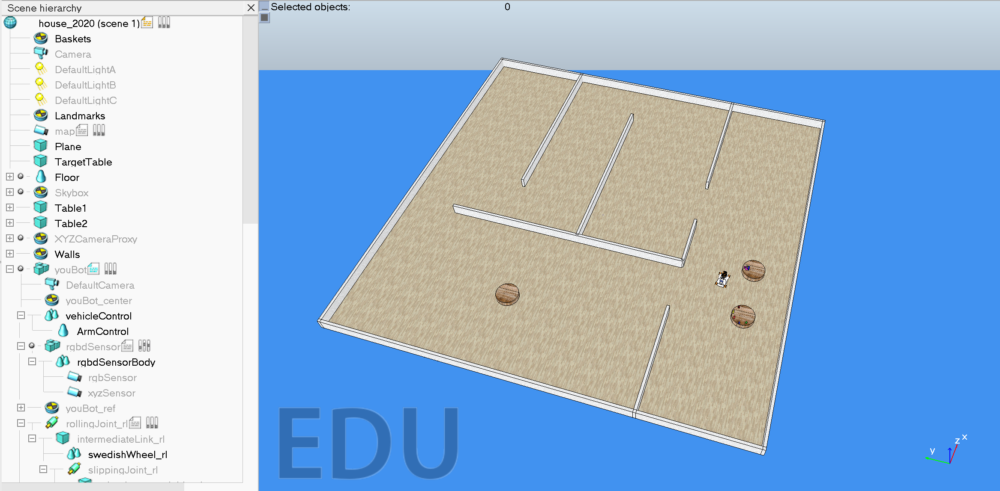

# 2021-2022 Project

## Context

In this project, you will program a robotic agent that (i) gathers information about its environment using the sensors, (ii) plans a set of actions to respond appropriately to sensed data based on a pre-existing strategy, and (iii) executes a set of motor commands to carry out the actions that the plan calls for. The robot will be simulated in the robot simulator [CoppeliaSim](https://www.coppeliarobotics.com/).

The general framework for the project relies on [TRS](http://ulgrobotics.github.io/trs/), an open-source project developed by [Renaud Detry](http://renaud-detry.net/). You can find useful information there but all the information that you need is available in this new repository:
*   [detailed installation instructions](https://github.com/nvecoven/INFO0948-2/tree/main/Setup),
*   [complete demo of the youBot (Python)](https://github.com/nvecoven/INFO0948-2/tree/main/Setup/Python/Youbot),
*   [list of allowed/forbidden functions](https://github.com/nvecoven/INFO0948-2/tree/main/Setup/CoppeliaSim).

The [help](https://www.coppeliarobotics.com/helpFiles/) of the robot simulator CoppeliaSim is also a good source of information.

## Specific milestones

1. **Navigation**  
    For this milestone, the youBot will need to navigate in an unknown environment.

    <!-- you should build a custom controller for the youBot, which should use its holonomic properties. In particular, _we do not allow the use of pure pursuit controller controllerPurePursuit from Matlab's Robotics System Toolbox._ -->

    1. (compulsory): The youBot should explore the whole map (and build an appropriate representation), by accessing the GPS coordinates (i.e., `simxGetObjectPosition` can be used on the youBot's `ref`). For this milestone, you can also call `simxGetObjectOrientation` on the youBot's `ref` whenever needed.

    2. (compulsory): Same as (1.i), but `simxGetObjectPosition` cannot be used directly. The youBot has access to its distance to three beacons sending radio signals through the sensor. This information can be obtained through the function `youbot_beacon(vrep, clientID, beacons_handle, youbot_handle, flag, noise=True)` with `flag = 0`. For this milestone, you can also call `simxGetObjectOrientation` on the youBot's `ref` whenever needed.    

    3. (optional): Same as (1.i), but `simxGetObjectPosition` cannot be used directly. The youBot has access to its distance to three beacons sending radio signals only when it is inside a radius of 5 m to the beacon. This information can be obtained through the function `youbot_beacon(vrep, clientID, beacons_handle, youbot_handle, flag, noise=True)` with `flag = 1`. For this milestone, you can also call `simxGetObjectOrientation` on the youBot's `ref` whenever needed.

    The size of the house is fixed (see `house_2022.ttt`). However, the youBot does not know the layout of the house a priori. All obstacles are high enough to be detectable with the Hokuyo sensor. There are no holes or open doors leading outside the house. There are three tables around the house. The location of tables with objects is fixed, but the target table's location is not. Tables are cylinders, 800 mm in diameter, and 185 mm in height.

2. **Manipulation**  
    For this milestone, the youBot will need to access a “TargetTable” object, which position you will have to find thanks to the youBot's sensors. Note that this table is the same as the ones on which objects are initially lying. _To distinguish them, you can make the assumption that the "TargetTable" will always start empty (no objects initially lying on it)._

    1. (compulsory): The youBot should grab all the objects on the first table (where objects stand upright), without any falling on the ground and put them on the target table.

    2. (optional): The youBot should grab all the objects on both tables, without any falling on the ground and put them on the target table.

## Instructions

* You can work in teams of up to two people.

* Your deliverables must be submitted as a _zip_ archive on the [Gradescope platform](https://www.gradescope.com/) in Assignements.

* Important dates (unless otherwise noted, all project items are due by 8 PM):

    * :bangbang: Wed April 20, 2022 at 8 PM: midterm code and report,
    * :bangbang: end of May: final code and report,
    * :bangbang: June (during the exam session): final presentation.

## Midterm report

For the midterm report, we expect you to complete the **Navigation (1.i)**.

Each team must submit their work in two parts on [Gradescope](https://www.gradescope.com/) before :bangbang: Wed April 20, 2022 at 8PM :bangbang:.

1.  In *Midterm (code + video)*, submit a _zip_ archive that contains:

    *   The source code of the youBot.

    *   A short (commented) video or a link to the video (max. 5 minutes).

        In the video, the youBot should explore and eventually map its entire environment. The video should show the youBot in action but should also emphasize how the youBot plans its actions. For example, showing the evolution of the map as the youBot builds it, showing potential new targets to explore and how the youBot chooses one, showing the planned trajectory to the chosen target, etc.
        
        The video should last (at most) 5 minutes.

2.  In *Midterm (report)*, submit a short written report named `midterm-report.pdf` (max. 1 page).

    In the report, you should summarize the main points of your implementation. The report should _not_ consist of a list of functions that you used in your project. We are more interested in the _why_ than the _what_. For example, if you chose a specific pathfinding algorithm, explain why this one and not another. In addition, the report should contain a diagram of the finite state machine controlling your youBot.

    The report should be (at most) one page long using the provided LaTeX template ([ieeeconf.zip](docs/ieeeconf.zip)).

## Help for Gradescope submission

Each student should register on [Gradescope](https://www.gradescope.com/) using his or her `@student.uliege.be` address. If you don't see the class INFO0948-2 on your dashboard, contact us on [Ed](https://edstem.org/us/dashboard) as soon as possible (don't wait the day before the deadline ;-). 

Each group should submit their work on [Gradescope](https://www.gradescope.com/). Make sure that all group members are correctly added to the submission!

If you are not familiar with Gradescope, please click on each step of the following guideline:
- [PDF submission](https://help.gradescope.com/article/ccbpppziu9-student-submit-work#submitting_a_pdf), 
- [Code submission](https://help.gradescope.com/article/ccbpppziu9-student-submit-work#code_submissions), 
- [Adding group members](https://help.gradescope.com/article/m5qz2xsnjy-student-add-group-members).

## Useful links

<!-- *   [Robotics System Toolbox](https://www.mathworks.com/products/robotics.html), by MathWorks
*   [Robotics Toolbox for MATLAB](https://petercorke.com/toolboxes/robotics-toolbox/), by Peter Corke -->
*   [OBS Studio](https://obsproject.com/), a free and open-source software suite for recording

## Montefiore server access via ssh

[Document borrowed from INFO2009.](docs/devoirs-ssh.pdf)

