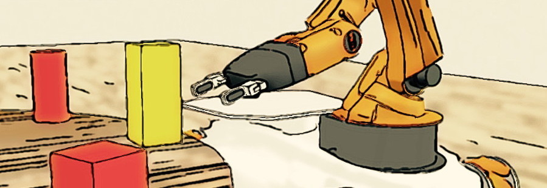
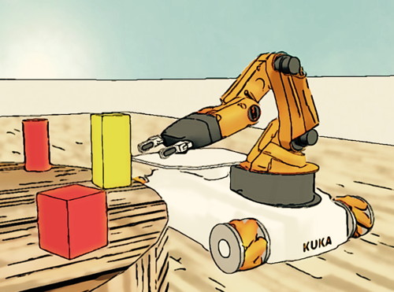

# **TRS:** An open-source recipe for teaching/learning robotics with a simulator

###### :: setup a laptop in 5 minutes, write a control, navigation, vision or manipulation program in 100 lines of code

## Motivation

TRS is an open-source recipe for organizing a master-level robotics project. It relies on a cross-platform robot development and simulation environment that can be installed in five minutes and that allows students to write control, navigation, vision or manipulation algorithms in a hundred lines of Python or MATLAB code. TRS contains a project structure (documentation, objectives, milestones), and the software skeleton for running the project (simulator models, Python/MATLAB code examples, install instructions). It is freely available and extendable.

Because working with hardware is time-consuming, many Master-level and PhD-level robotics courses leave hardware issues aside, to give the students time to study theoretical concepts and information-processing algorithms. Unfortunately, hardware-free courses often come with no hands-on exercises, which impedes learning. Here, we consider one solution to this problem: allowing students to gain practical experience in a simulated environment. Open-source simulators have existed for a long time, but their limited ease-of-use made them impractical for teaching. Ease of use is crucial in teaching: The software must be robust, multi-platform, and its installation has to be trivial. [CoppeliaSim](http://www.coppeliarobotics.com) (formerly known as V-REP), the simulator on which TRS is based, can be installed on Linux, macOS and Windows simply by uncompressing zip archive.



<!-- Software development is another major challenge in robot development. TRS is based on the [Robotics Toolbox for MATLAB](http://petercorke.com/Robotics_Toolbox.html) (RTB), a library of robot-oriented software building blocks. Its MATLAB implementation makes it accessible to branches of engineering where fluency in C++ is not expected. -->

TRS is an environment, based on CoppeliaSim, that allows students to control a robot from Python or Python/MATLAB. The environment consists of a set of Python/MATLAB scripts, and a CoppeliaSim file modeling a mobile robot and a building floor. Running a single Python/MATLAB command establishes a connection between Python/MATLAB and CoppeliaSim. The user is then able to recover sensor data (images, scans, odometry), process those data, and send commands to the robot's actuators. The robot's sensors and actuators are accessed via Python/MATLAB functions:

```
vrep.simxSetJointTargetVelocity(id, wheel1, 10);
```

An understanding of the simulator itself is not required, as all the programming is done through the Python/MATLAB interface.

The behavior of the youBot shown in this video is coded in Python/MATLAB in 500 lines of code. The youBot explores and maps its environment, and it detects and marks rounded baskets. The code runs in quasi-realtime on a standard laptop. Download this video in [MP4/H.264](http://renaud-detry.net/teaching/info0948/raster/youbot.mp4) or [WebM/VP8](http://renaud-detry.net/teaching/info0948/raster/youbot.webm), or [view it on Youtube](https://www.youtube.com/watch?v=bPSdZCewp7Y).

## What you get

TRS provides a recipe for organizing a Master-level robotics project. The project consists in using a mobile robot to pickup groceries from a table and move them to different baskets distributed across a house. The project involves control, navigation, mapping, vision and manipulation. The recipe is composed of:

*   a page that explains how to [setup](./Setup/) a laptop to work on the project
*   a page that presents the [project definition](./Projects/): objectives, milestones, a description of the robot and the documentation of the Python/MATLAB functions that access the robot's sensors and actuators
*   a Python/MATLAB script that illustrates access the robot's sensors and actuators
*   a CoppeliaSim model of a building floor, and a few Python/MATLAB scripts that make programming easier

## How to use

TRS is intended primarily for teachers, but students are welcome to use it for personal projects.

The TRS recipe is freely distributed via a [GitHub repository](https://github.com/ULgRobotics/trs) (`https://github.com/ULgRobotics/trs.git`). The code and the CoppeliaSim models are in the [master branch](https://github.com/ULgRobotics/trs/tree/master)), and the doc is in the [gh-pages](https://github.com/ULgRobotics/trs/tree/gh-pages) branch. The page that you are reading now is generated by the GitHub Pages service from the [gh-pages](https://github.com/ULgRobotics/trs/tree/gh-pages) branch — in other words, everything you see on this website can be obtained by cloning the whole TRS repository. By cloning the repository, you can quickly adapt both the code and the web doc to your own likings.

All of the TRS material (code and documentation) is published under open licenses. The code is published under GPL, and the documentation (the pages published on this website) are CC. These licenses allow anyone to copy, improve, and hopefully contribute back, to provide robotics students with an excellent learning experience.

## Authors

TRS was created by [Renaud Detry](http://renaud-detry.net/) for a [course taught at the University of Liège](http://renaud-detry.net/teaching/info0948/), with lots of help from [Coppelia Robotics](http://coppeliarobotics.com), [Peter Corke](http://petercorke.com), and [Thibaut Cuvelier](http://www.montefiore.ulg.ac.be/~tcuvelier/) (videos and copy editing).

---

###### &copy; Renaud Detry 2014. This work is licensed under a [Creative Commons Attribution 4.0 International License](http://creativecommons.org/licenses/by/4.0/).


<!--
---

## This repository contains all the files and informations needed for the projects of the robotic's course.

You can make sure that CoppeliaSim is setup correctly by following the instructions in the Setup Folder. Once done, read
the instructions regarding the project in the Projects folder and proceed to test the appropriate Robot in the given scene.
Good luck.

http://ulgrobotics.github.io/trs/

-->
